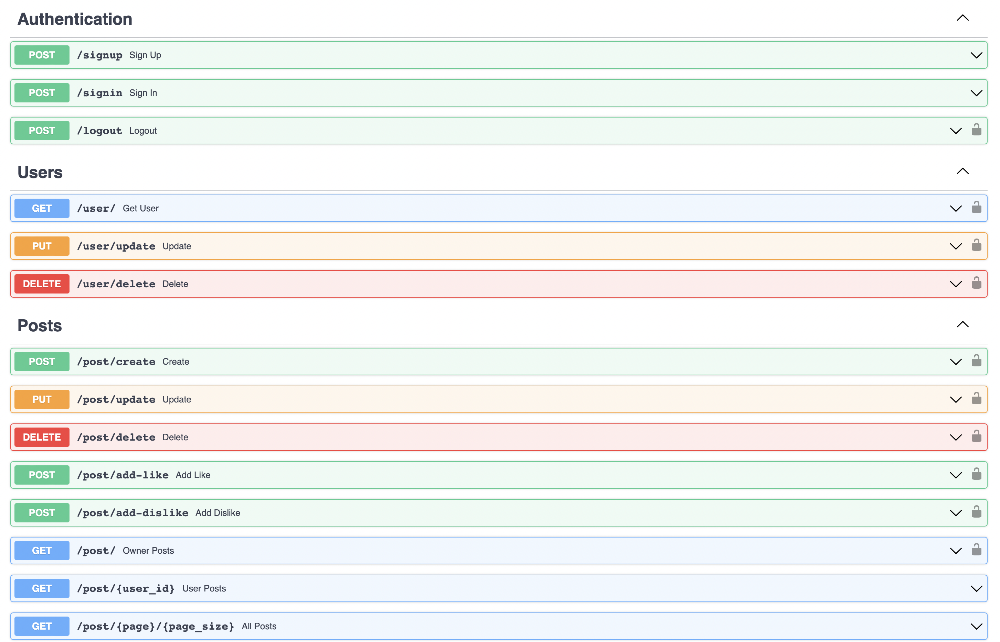

## Used technology
- Python 3.11-buster;
- FastApi ( Web framework for building APIs );
- Docker and Docker Compose ( containerization );
- PostgreSQL ( database );
- Redis ( cache, database )
- SQLAlchemy ( working with database from Python );
- Alembic ( database migrations made easy );
- Pydantic ( models )

<hr/>



<hr/>

### Установка и запуск

1. Клонировать проект в удобное место:

```sh
git clone https://github.com/Whitev2/Webtronics.git
```

2. Собрать и запустить контейнеры:
```sh
docker-compose up -d --build
```
<hr/>

### Дополнительные команды


1. Создание файла миграций:
```sh
docker-compose exec backend alembic revision --autogenerate -m "revision_name"
```

2. Обновление базы данных:
```sh
docker-compose exec app alembic upgrade head
```

3. Остановка контейнеров:
```sh
docker-compose down
```

4. Запуск контейнеров:
```sh
docker-compose up
```

<hr/>


### API:  Аутентификация / Регистрация

#### POST [/signup](http://localhost:8000/docs#/Authentication/sign_up_signup_post) - Регистрация пользователя

- Создает новый jwt токен с временем истечения

#### POST [/signin](http://localhost:8000/docs#/Authentication/sign_in_signin_post) - Аутентификация пользователя
- Создает новый jwt токен с временем истечения

#### POST [/logout](http://localhost:8000/docs#/Authentication/logout_logout_post) - Выход пользователя из системы
- Токен добавляется в redis на время его истечения 
- Нет возможности повторно использовать токен

<hr/>

### API:  Пользователь

#### POST [/user/](http://localhost:8000/docs#/Users/get_user_user__get) - Получение данных о текущем пользователе
- Необходима аутентификация

#### POST [/user/update](http://localhost:8000/docs#/Users/update_user_update_put) - Обновление данных пользователя
- Необходима аутентификация

#### POST [/user/delete](http://localhost:8000/docs#/Users/delete_user_delete_delete) - Удаление пользователя
- Необходима аутентификация
- Позволяет удалить аккаунт пользователя из базы
- Удалит все посты, созданные пользователем
- Удалит все реакции связанные с постами

<hr/>

### API:  Публикации

#### POST [/post/create](http://localhost:8000/docs#/Posts/create_post_create_post) - Создание новой публикации
- Необходима аутентификация

#### POST [/post/update?post_id=ID](http://localhost:8000/docs#/Posts/update_post_update_put) - Создание новой публикации
- Необходима аутентификация
- Позволяет обновлять информацию о посте по ID
- Обновлять может только владелец

#### POST [/post/delete?post_id=ID](http://localhost:8000/docs#/Posts/delete_post_delete_delete) - Удаление публикации
- Необходима аутентификация
- Удалит пост по ID
- Удалит все реакция связанные с постом

#### POST [/post/add-like?post_id=ID](http://localhost:8000/docs#/Posts/add_like_post_add_like_post) - Добавление лайков к публикации
- Необходима аутентификация
- Позволяет добавлять лайки к публикациям по ID
- Владелец публикации не может добавить к ней лайк 
- Если до этого был дизлайк - он инвертируется в лайк
- В случае повторного запроса - лайк убирается

#### POST [/post/add-dislike?post_id=2ID](http://localhost:8000/docs#/Posts/add_dislike_post_add_dislike_post) - Добавление дизлайков к публикации
- Необходима аутентификация
- Позволяет добавлять дизлайки к публикациям по ID
- Владелец публикации не может добавить к ней дизлайк 
- Если до этого был лайк - он инвертируется в дизлайк
- В случае повторного запроса - дизлайк убирается

#### POST [/post/](http://localhost:8000/docs#/Posts/owner_posts_post__get) - Публикации текущего пользователя
- Необходима аутентификация
- Вернет все публикации пользователя

#### POST [/post/{user_id}](http://localhost:8000/docs#/Posts/user_posts_post__user_id__get) - Публикации пользователя по ID
- Вернет все публикации пользователя

#### POST [/post/{page}{page_size}](http://localhost:8000/docs#/Posts/all_posts_post__page___page_size__get) - Все публикации
- Вернет все публикации
- Позволяет переключать страницы и выбирать размер страницы


