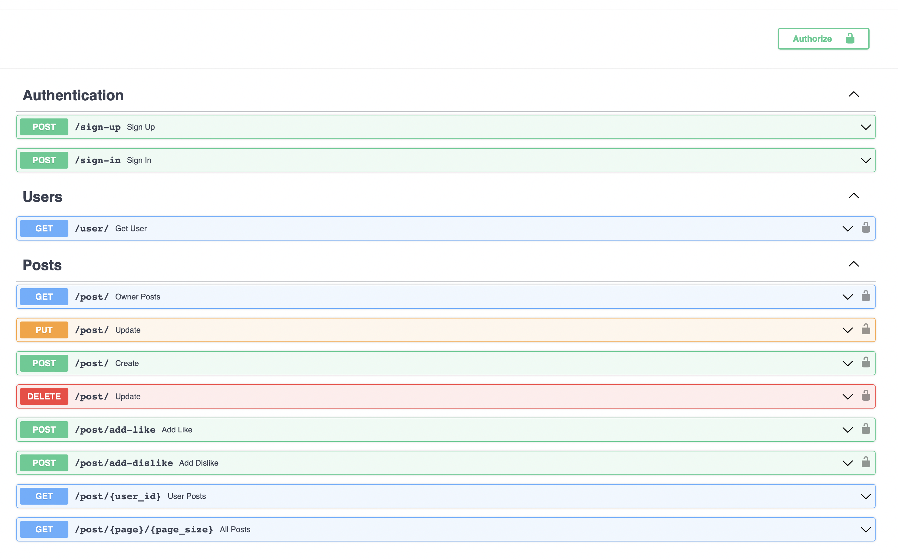

# Used technology
- Python 3.11-buster;
- FastApi ( Web framework for building APIs );
- Docker and Docker Compose ( containerization );
- PostgreSQL ( database );
- SQLAlchemy ( working with database from Python );
- Alembic ( database migrations made easy );
- Pydantic ( models )

<hr style="border-width: 10px; border-color: red;">



<hr/>

### Installation

```sh
docker-compose build
```

```sh
docker-compose up
```

<hr/>


### Migrations

```sh
docker-compose exec backend alembic revision --autogenerate -m "name"
```

```sh
docker-compose exec backend alembic upgrade head
```

<hr/>

